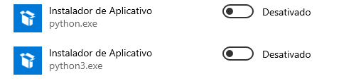

 

# Cotacao de Criptomoeda Real Time com Pyspark - Machine Learning
Prevendo a Cotação de Criptomoedas em Tempo Real com PySpark e Machine Learning

# Objetivo
O objetivo deste projeto é usar um importante contexto de negócio (área de finanças) para estudar ferramentas de análise de dados. Vamos abordar o projeto desde a concepção do problema de negócio a ser resolvido até a entrega do modelo preditivo.

# Definição do problema
O objetivo deste projeto será construir um modelo de Machine Learning capaz de prever a cotação de criptomoedas. Usaremos dados sobre o Bitcoin.

  

Bitcoin é a criptomoeda mais antiga e conhecida, lançada pela primeira vez como código 
aberto em 2009 pelo anônimo Satoshi Nakamoto.  O Bitcoin serve como um meio descentralizado de troca digital, com transações  verificadas e registradas em um livro público distribuído (a Blockchain) sem a necessidade de  uma autoridade de manutenção de registros ou intermediário central.  Os blocos de transação contêm um hash criptográfico SHA-256 de blocos de transação  anteriores e, portanto, são "encadeados" juntos, servindo como um registro imutável de todas as transações que já ocorreram. 

Usaremos dados históricos de cotação do Bitcoin de 2011 a 2021. 

O dataset pode ser baixado no link abaixo:

https://drive.google.com/file/d/1zov5-RWVpyQk8vRvZXb9u3XUrWzasPvw/view?usp=sharing

Em função do tamanho do arquivo, optamos por realizar uma divisão dos dados, em porções menores, para aplicar as etapas de analise exploratória, processamento, criação e otimização do modelo, sem comprometer o processamento dos dados.

# Preparação do Ambiente Spark

  

Para instalação e configuração do ambiente Apache Spark no Windows, para utilização do pacote Pyspark, é necessário seguir os procedimentos abaixo:

#### 1-	Faça o download o Java JDK 11 e instale na sua máquina. Baixe a versão com arquivo exeno link abaixo (pode usar qualquer release, desde que seja versão 11.x):

https://www.oracle.com/java/technologies/javase/jdk11-archive-downloads.html

#### 2-	Configure as variáveis de ambiente abaixo:

JAVA_HOME = C:\java\jdk11

PATH = %PATH%;%JAVA_HOME%

Link para referência

https://geekflare.com/system-environment-variables-in-windows/

#### 3-	Baixe os binários do Apache Spark do link: 
https://spark.apache.org/downloads.html

#### 4-	Para instalar executamos o comando pip install pyspark no prompt de comando.

  

#### 5-	É necessário também desabilitar as opções de aliases de execução do python, para ele não buscar o executável do python na Microsoft Store. Digite Aliases de execução de app na caixa de busca, e desative as opções de python.

  

  

#### 6-	Configure as variáveis de ambiente abaixo:

SPARK_HOME = C:\spark
HADOOP_HOME = C:\spark
PATH=%PATH%;%SPARK_HOME%

#### 7-	Faça o download do winutils no link abaixo:

https://github.com/steveloughran/winutils/blob/master/hadoop-2.7.1/bin/winutils.exe

#### 8-	Copie o arquivo winutils para a pasta bin dentro da pasta do Spark.

#### 9-	Abra o prompt de comando e execute: spark-shell. Se abrir o Shell isso indica que a configuração foi feita corretamente.

Use o link abaixo como referência para mais detalhes:

https://sparkbyexamples.com/spark/apache-spark-installation-on-windows/
